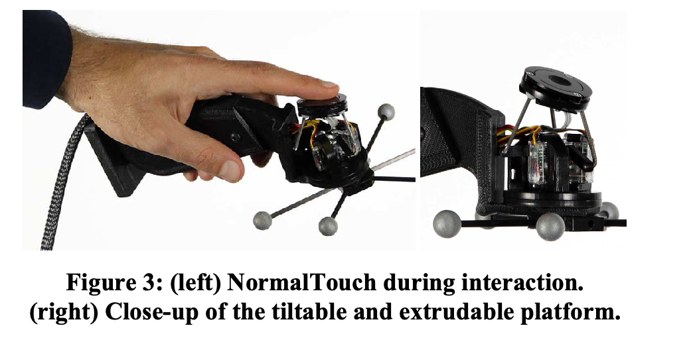
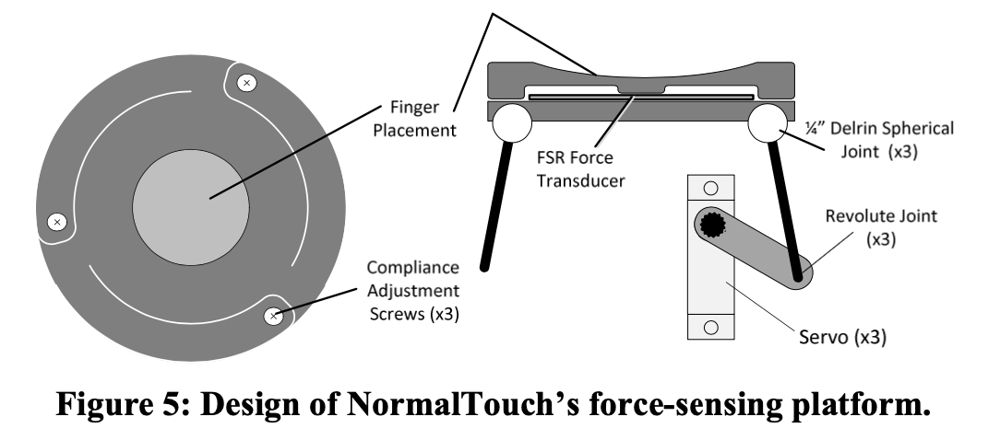
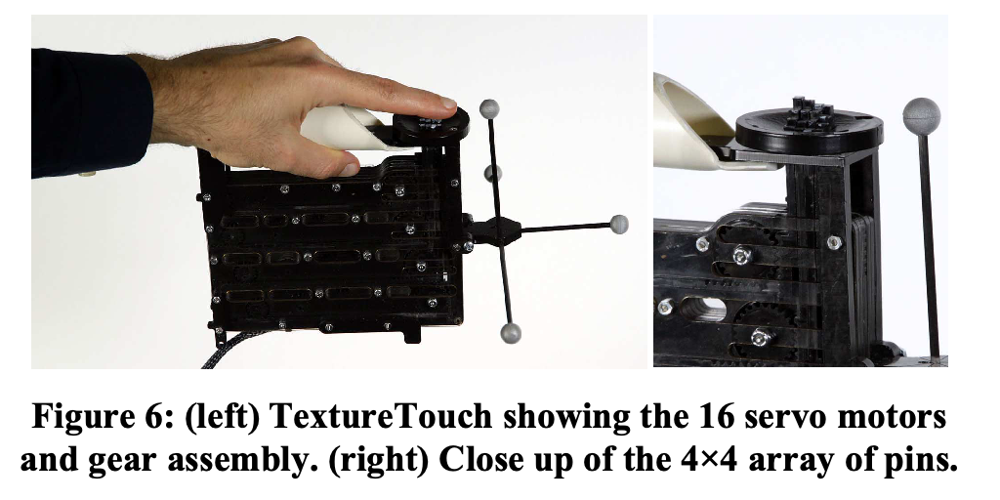
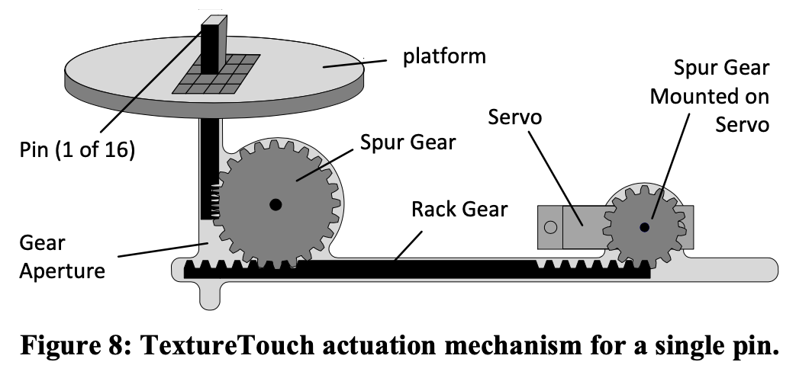
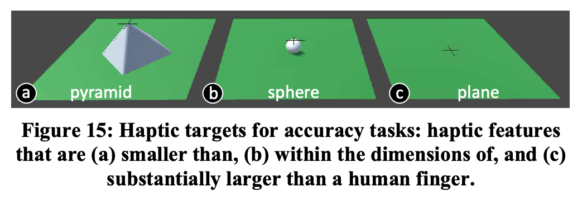
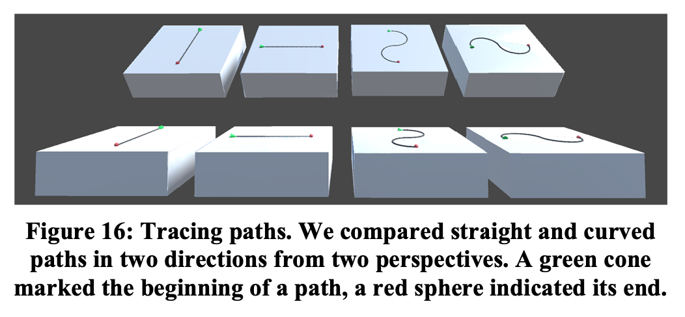
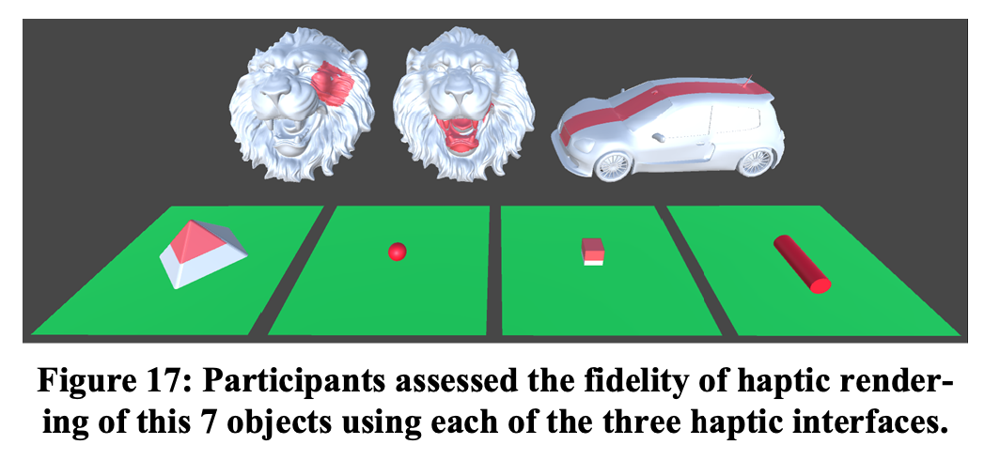

<!-- _paginate: false -->

# 論文輪講 第 04 回

#### B4 20FI086

#### 橋本慶紀 🦭

---

<!-- _paginate: false -->

# 進捗発表

---

<!-- _header: 'オープンキャンパスでやったこと' -->

## Can you hear me?

- プロンプト(入力)を音声で取得
- 入力された内容を ChatGPT API を使って送信、結果を得る
- 取得した結果を、Google の音声合成 API に送り、回答を音声で得る
- 取得した音声を再生する
- その音声が入った QR コードを印刷する

- ほんとは質問と回答を 1 つの QR コードにしたかったけど実現できず

---

<!-- _header: 'オープンキャンパスでやったこと' -->

## SayCheese! (tentative)(撮音機)

- 録音された音声をクラウドにアップロードする
- アップロードされた音声を再生できる QR コードを出力する
- Raspberry Pi を焼き直してセットアップしたらなぜか動かず、、、🥺
- 動くようにして、これで論文を書いてしまおうと画策

---

<!-- _header: '読んだ論文 1' -->

### NormalTouch and TextureTouch: High-fidelity 3D Haptic Shape Rendering on Handheld Virtual Reality Controllers

学会名: UIST '16:User Interface Software and Technology

---

# 選んだ理由

- Haptic Revolver の関連研究

---

# 論文概要

- NormalTouch 、TextureTouch、2 つの触覚インタフェースの提案
- NormalTouch は指と VR 空間内のオブジェクトととの接触面の法線を再現する
- TextureTouch は指の触れているオブジェクトのテクスチャを再現する

---

## この論文の提起する問題

- 今まで、指に装着するデバイス・手袋型デバイス・ロボットアームなどが提案されていた
- これらは、豊かな触角刺激をもたらすが、装置を身につける必要がある

---

# 紹介動画

[Haptic Revolver](https://youtu.be/KhbUg3_3T0I)

---

<!-- _header: 'NormalTouch' -->

---

<!-- _header: 'NormalTouch' -->

---

<!-- _header: 'TextureTouch' -->

---

<!-- _header: 'TextureTouch' -->

---

<!-- _header: '-' -->

## 評価方法

- 被験者に、3 つのタスクを 4 通りの方法で実行してもらい、その結果をアンケート調査する
  - 視覚のみ | 振動モータ | NormalTouch | TextureTouch
  - それぞれで 3 つのタスクをこなしてもらう
  - 正確さやかかった時間も計測

---

<!-- _header: 'タスク1' -->

---

<!-- _header: 'タスク2' -->

---

<!-- _header: 'タスク3' -->

---

<!-- _header: '実験結果' -->

- 触覚のフィードバックがあると、視覚のみよりタスクの実行精度が高かった
- 視覚のみが一番はやいと予想していたが、何らかの触覚フィードバックがある方が、タスクの実行速度が速かった

---

<!-- _header: 'この論文を読んで参考になったこと' -->

### 提案そのものについて

- 触覚デバイスの詳細な構造や、使っているセンサの名前がわかって参考になった
- 少人数(今回は 12 人)に幾つかのタスクを試してもらう、という評価手法は参考になる

---

<!-- _header: 'この論文を読んで参考になったこと' -->

### 結果・考察について

- 一見 TextureTouch の方が良さそうに見えるが、実験の結果では、NormalTouch と TextureTouch の間で、精度や満足度に有意差さはないとの事
- 正確な触覚レンダリングができなくても、被験者は正確なように錯覚する
  - 視覚の情報の占める割合がやはり大きい
  - 触覚デバイスはアバウトでもいいのかも
- NormalTouch みたいなの作ろうかと思う
